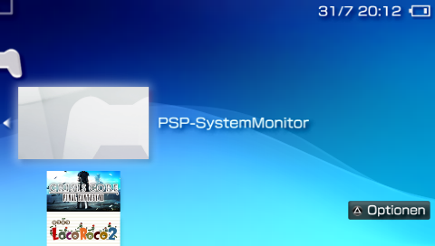
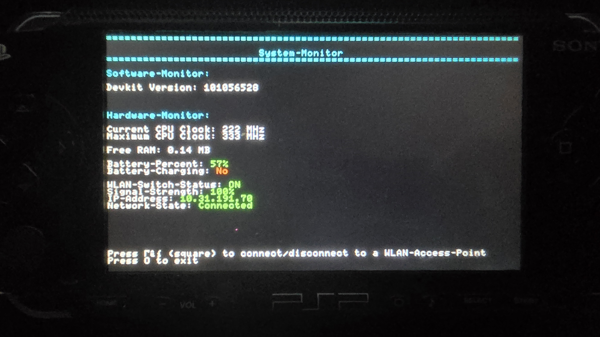

# PSP-SystemMonitor

- A homebrew system monitor application for the Sony PSP, written in **C** using the **PSPSDK**.
- Designed to display real-time PSP system metrics (battery status, CPU metrics, RAM usage) in a clean interface.
- Built as an introductory project to low-level C programming and PSP homebrew development.

## Features

- **Real-Time System Metrics:** Displays core hardware statistics directly on the PSP screen.
- **Hardware Controller Input:** Full navigation powered by PSP buttons via the SDK input interface.
- **Colored UI Menu:** Clean, color-coded menu layout for improved readability.
- **Extensible Architecture:** Modular structure allowing easy integration of additional system calls and metrics.

## Tech Stack & Toolchain

- **Language:** C
- **SDK:** PSPSDK
- **Build System:** GNU Make (Makefile)
- **Version Control:** Git, GitHub

## Roadmap

- [x] Project & Toolchain setup (PSPSDK, GitHub repository)
- [x] Hello World execution on hardware/emulator
- [x] Controller input processing (`pspctrl` handling)
- [x] Main menu structure implementation
- [x] Battery status tracking (charge percentage, battery life time)
- [x] RAM / Memory allocation usage display
- [x] CPU frequency and status monitoring
- [x] Devkit / Firmware version detection
- [x] Screen refresh loop optimization
- [x] Color-coded UI interface
- [ ] *Optional / Planned:* Graphical user interface (GUI) with custom assets

## Installation & Setup

To install and run **PSP-SystemMonitor** on a custom firmware PSP:

1. Download the latest `EBOOT.PBP` file from the **Releases** section on GitHub.
2. Connect your PSP to your computer using a USB cable (navigate to **Settings → USB Connection** on your PSP).
3. Open the PSP Memory Stick directory and navigate to `PSP/GAME/`.
4. Create a new folder inside `GAME` named `SystemMonitor`.
5. Copy the downloaded `EBOOT.PBP` file into the newly created `PSP/GAME/SystemMonitor/` directory.
6. Safely disconnect your PSP from your computer.
7. Launch **SystemMonitor** from the **Game → Memory Stick** menu on your PSP.

## Demo

- **App on PSP Homescreen:**  
  

- **Start Menu:**  
  

- **System Monitor (WLAN Offline):**  
  

- **System Monitor (WLAN Online):**  
  
