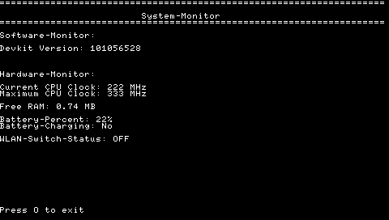

# PSP-SystemMonitor

- in Homebrew-SystemMonitor für die Sony PSP, geschrieben in C mit dem PSPSDK.
- Das Programm soll verschiedene Systeminformationen der PSP, wie Akkustand, CPU-Daten, etc übersichtlich auf dem Bildschirm darstellen und soll als erstes Einstiegsprojekt in die Entwicklung von PSP-Homebrew Anwendungen, bzw allgemein als Einstieg in die hardwarenahe Entwicklung mit C für mich dienen.

## Features

- Anzeige von Systeminformationen direkt auf der PSP 
- Controllersteuerung
- Übersichtliche Benutzeroberfläche 
- Erweiterbar um weitere Systeminformationen 

## Roadmap

- [x] Projekt aufsetzen (PSPSDK, GitHub-Repository)
- [X] Erstes Programm auf der PSP ausführen
- [X] Controller-Eingaben verarbeiten
- [X] Menü erstellen
- [X] Batteriestatus anzeigen
- [X] Informationen zum Arbeitsspeicher anzeigen
- [X] CPU-Informationen anzeigen
- [X] Devkit-Version anzeigen
- [X] Bildschirm regelmäßig aktualisieren
- [ ] Optional: Farbiges Menü
- [ ] Optional: Grafische Oberfläche

## Tech Stack

- Sprache: C
- SDK: PSPSDK
- Build-System: Make
- Versionsverwaltung: Git, GitHub

## Demo: 

